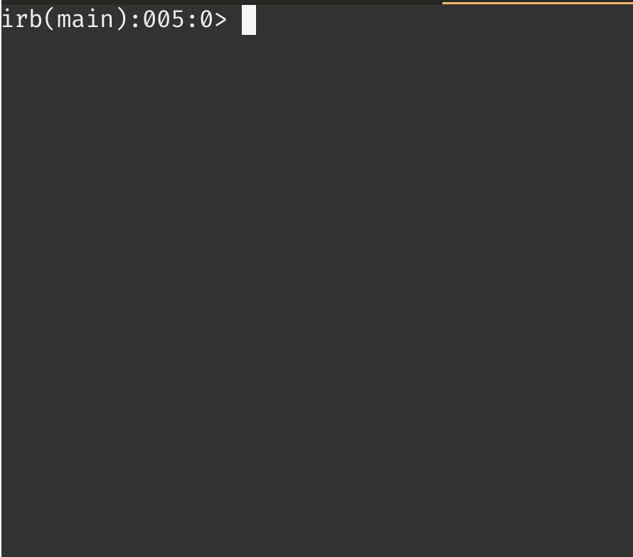
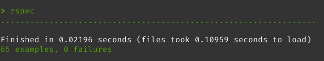

# Tic Tac Toe Game

Play the classic game of Tic Tac Toe with this interactive implementation that utilizes Object Oriented Programming principles. 

## Features



### Interactive Game Modes

Choose from three different game modes:

1. **Human vs. Human**
2. **Computer vs. Computer**
3. **Human vs. Computer**

### Difficulty Levels

When playing against the computer, users can select from three levels of difficulty:

1. **Easy Mode**: The computer randomly selects an available spot.
2. **Medium Mode**: The computer selects available spots with defense in mind. If there are no defensive moves to make, it selects a spot at random.
3. **Hard Mode**: The computer strategically chooses spots to try and win the game. It looks for central position to make its move and actively searches for opportunities to win the game.

## How to Run

The entire game is encapsulated under the `Game` object. To play the game, follow these steps:

1. Load the main library in any Ruby REPL:

```zsh
$ irb -r ./lib/game.rb
```

2. Start the game by creating a new Game object and running the start method:

```ruby
irb(main):001:0> Game.new.start
```

## Testing

This project is fully tested with RSpec, including both unit and integration tests. To watch the tests using Guard:


```zsh
$ bundle exec guard
```

#### Results


